# Virtual Makerspace

> A research-grade WebXR prototype for studying embodied learning behavior in an electronics-breadboard task.

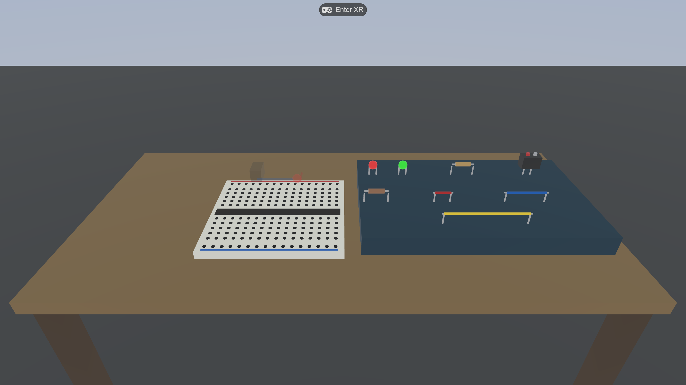

## Implementations

This repository now contains two complementary prototypes:

- **IWSDK WebXR** (repository root): browser-based breadboard study apparatus with telemetry.
- **Unity Quest classroom pilot** ([`unity/`](unity/README.md)): native Quest 2/3 build with Relay room creation/joining, Vivox voice, XR direct/ray interaction, collaborative component handoff, embedded beginner guidance, and Blender/PBR makerspace assets.

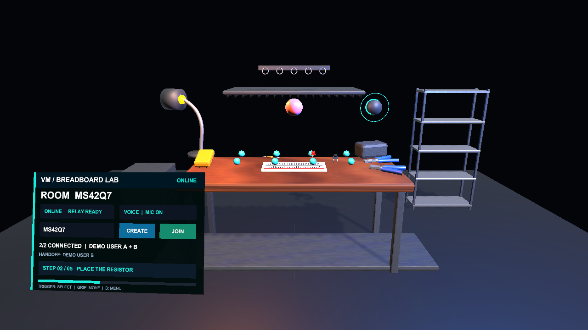

### Native Quest pilot release 1.0.7

The current Unity pilot build fixes the Quest floating-2D launch path by declaring and explicitly launching the Meta VR activity category. It includes:

- learner-facing **CREATE ROOM** and **JOIN ROOM** controls with a shared room code;
- automatic stale-lobby cleanup and one retry before reporting a room failure;
- Relay/Netcode two-person synchronization and Vivox group voice;
- microphone permission gating before Vivox joins the audio channel;
- automatic release of the lobby raycaster at `2/2 CONNECTED`, allowing Trigger interaction with breadboard parts; and
- an acceptance collector that records immersive OpenXR focus, room, voice, and part-grab evidence from each physical Quest.

Release verification: **29/29 Unity EditMode tests passed**, and independent Host/Guest player processes reached the same Relay room with Session `2/2` and Vivox connected. Physical Quest 2/3 acceptance remains an explicit field-test gate.

[Download the 1.0.7 Quest student test package](https://drive.google.com/file/d/1pX_TYJHi6xuoEq30zDsJqzfQez7jupyn/view?usp=drivesdk)

### Unity Quest activity walkthrough

These Unity-rendered guide captures use demo room code `MS42Q7` to show the intended learner sequence. They document the interface states; final live validation still requires two physical Quest headsets.

<table>
<tr>
<td width="50%">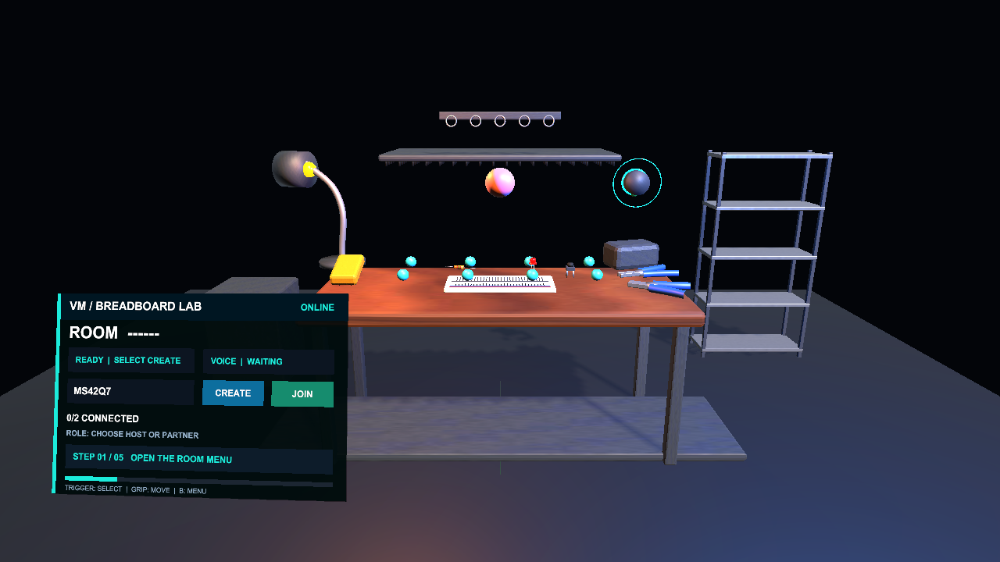<br/><b>1. Launch and choose a role.</b> Both learners confirm the workbench is visible. One becomes the host; the other becomes the partner.</td>
<td width="50%">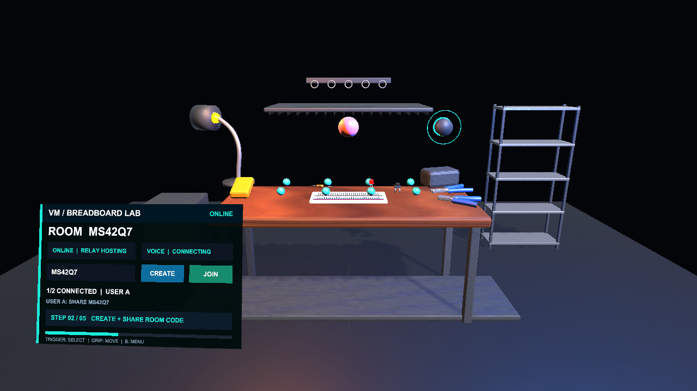<br/><b>2. User A creates the room.</b> Select <code>CREATE</code>, then read the room code aloud to User B.</td>
</tr>
<tr>
<td width="50%"><br/><b>3. User B joins and checks voice.</b> Enter the same code, select <code>JOIN</code>, confirm <code>2/2 CONNECTED</code>, and say “I can hear you.”</td>
<td width="50%">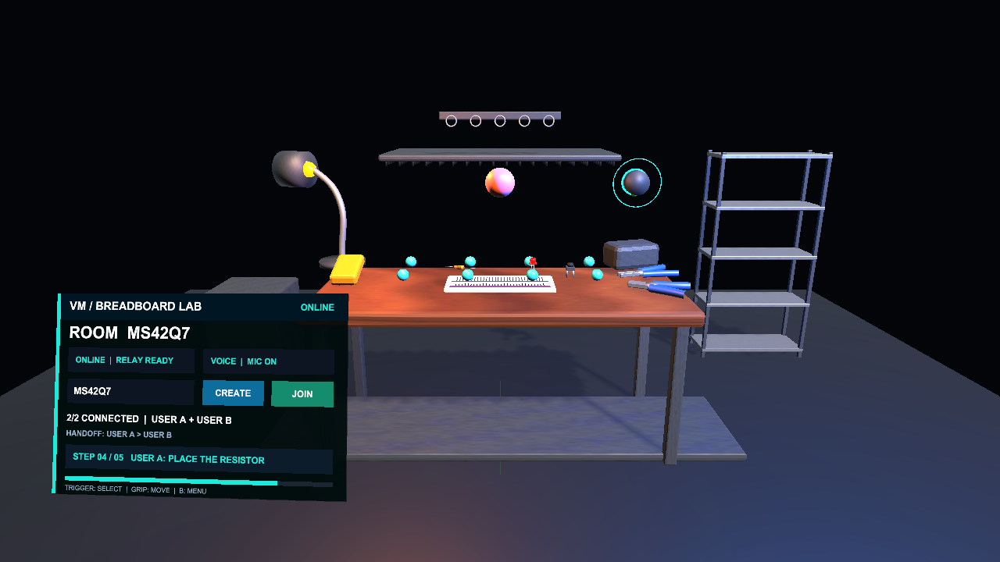<br/><b>4. User A places the resistor.</b> Explain the selected sockets, place the resistor, then hand the next decision to User B.</td>
</tr>
<tr>
<td colspan="2" align="center"><br/><b>5. User B places the LED; both explain and verify.</b> Check LED polarity, complete the placement, and jointly explain why the circuit should work.</td>
</tr>
</table>

Built on the [Immersive Web SDK](https://iwsdk.dev) — runs in the browser, deploys to any WebXR headset (Meta Quest 2/3/Pro), and instruments every grasp, snap, and circuit-state change with high-resolution telemetry.

---

## What is this?

A virtual electronics makerspace where a participant assembles a simple LED circuit on a breadboard using grabbable virtual components — battery, LEDs, resistors, wires. Every action is captured as a structured telemetry event for later analysis of exploration, manipulation, failure, and recovery patterns.

The artifact is a **study apparatus**, not a consumer product. The design prioritizes:

- **Total observability** — every grasp, release, snap, and circuit change is a typed event in IndexedDB
- **Productive Failure** framing (Kapur 2008) — minimal scaffolding, the participant must figure out the topology themselves
- **Deterministic replay potential** — the event log is a source-of-truth that can re-render the session
- **Same-build cross-site** — WebXR + bundled assets means a study in Seoul and a replication in Atlanta use bit-identical stimuli

See [`docs/mvp-scope.md`](docs/mvp-scope.md) for the full Phase 1 / Phase 2 scope and telemetry schema.

---

## Features

### Scene
- **Procedural breadboard** — 16 cols × 12 rows = 192 sockets rendered as a single InstancedMesh, with red/blue power-rail stripes and a center channel
- **Grabbable parts** — 2 LEDs, 2 resistors, 3 wires (short/medium/long), 1 9V battery — all with magnetic snap-on-release
- **Idle character** — robot walks a slow circle near the workspace (procedural animation, no rig)
- **Workspace** — table, tray, locomotion-enabled floor

<table>
<tr>
<td width="50%">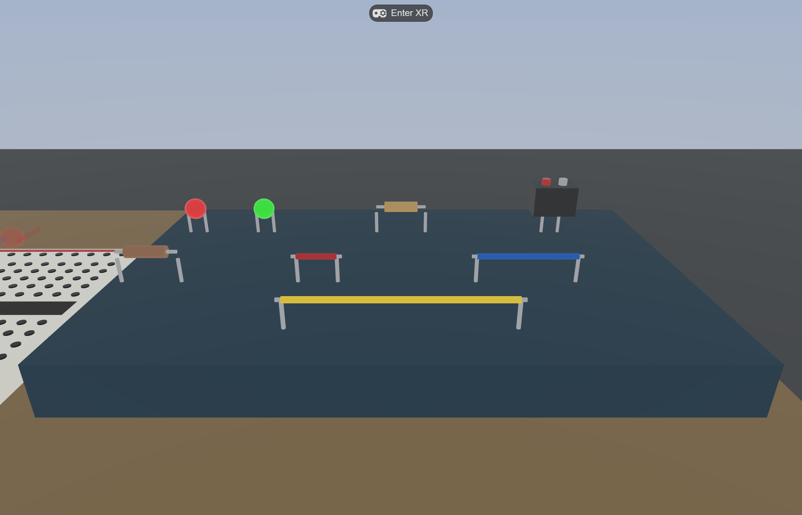<br/><sub>Tray with all eight grabbable parts: 2 LEDs, 2 resistors, 3 wires (short/medium/long), 1 battery.</sub></td>
<td width="50%">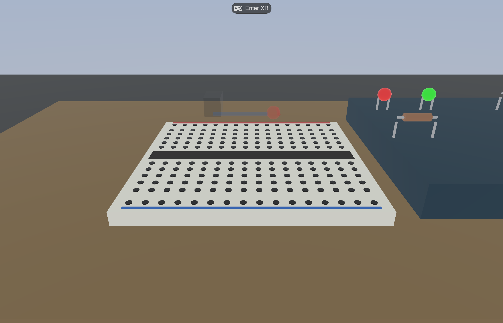<br/><sub>Breadboard with transparent placement guides — ghosts show the target circuit. Toggle with <kbd>G</kbd>.</sub></td>
</tr>
<tr>
<td width="50%">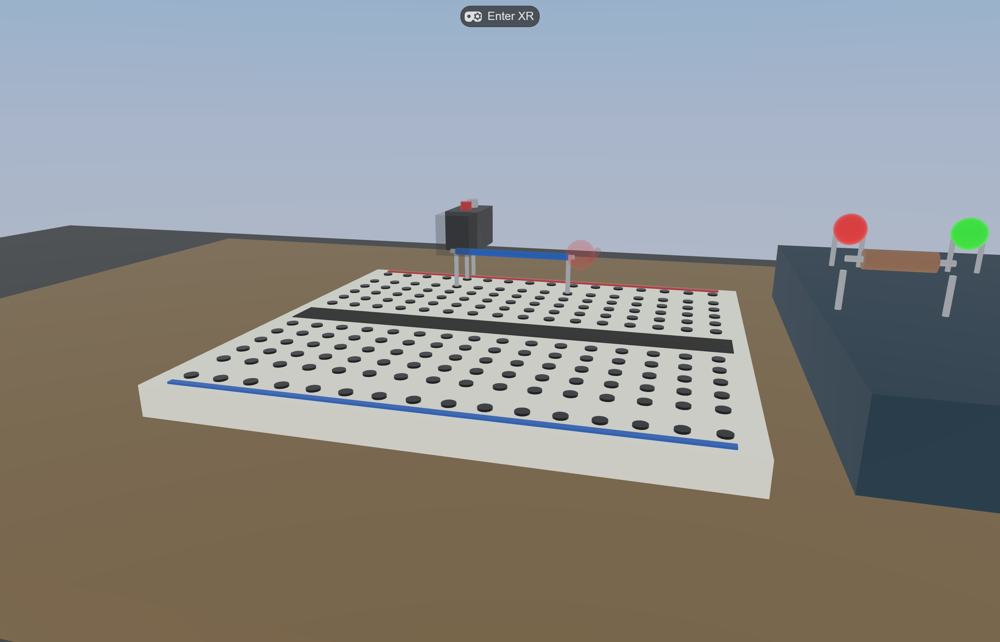<br/><sub>Mid-assembly: battery + medium wire snapped, LED still in the tray. Circuit not yet closed.</sub></td>
<td width="50%">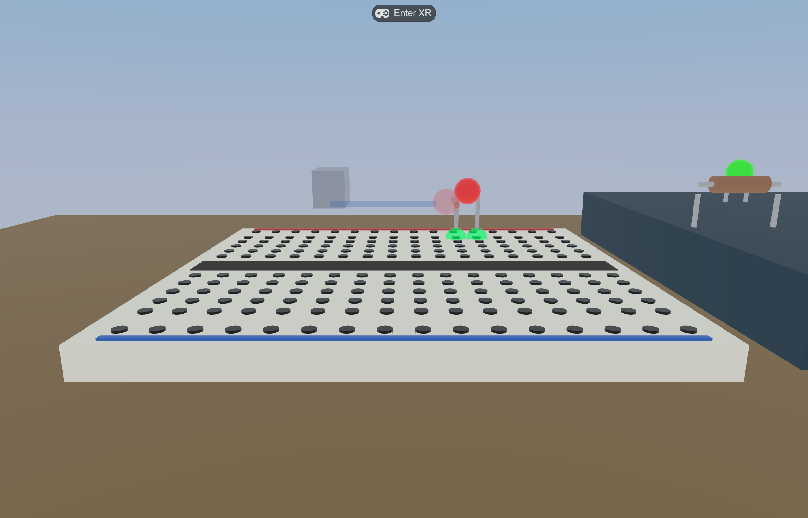<br/><sub><code>HoverPreviewSystem</code> — green socket markers light up while a part is held within 27 mm of two valid sockets.</sub></td>
</tr>
<tr>
<td width="50%">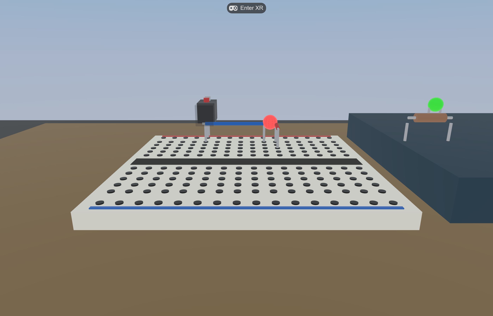<br/><sub>Assembled target circuit. <code>CircuitEvalSystem</code> closes the loop and <code>LedState.lit</code> flips → red LED glows.</sub></td>
<td width="50%">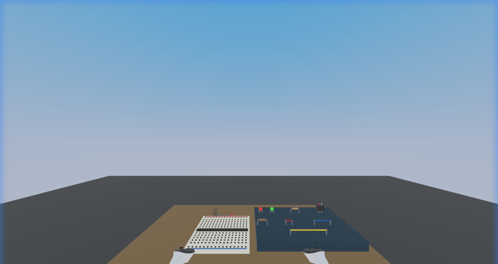<br/><sub>Controller wands visible after entering an XR session (via IWER's <code>RemoteControlInterface</code>). Spectator-style 3rd-person view.</sub></td>
</tr>
<tr>
<td colspan="2" align="center">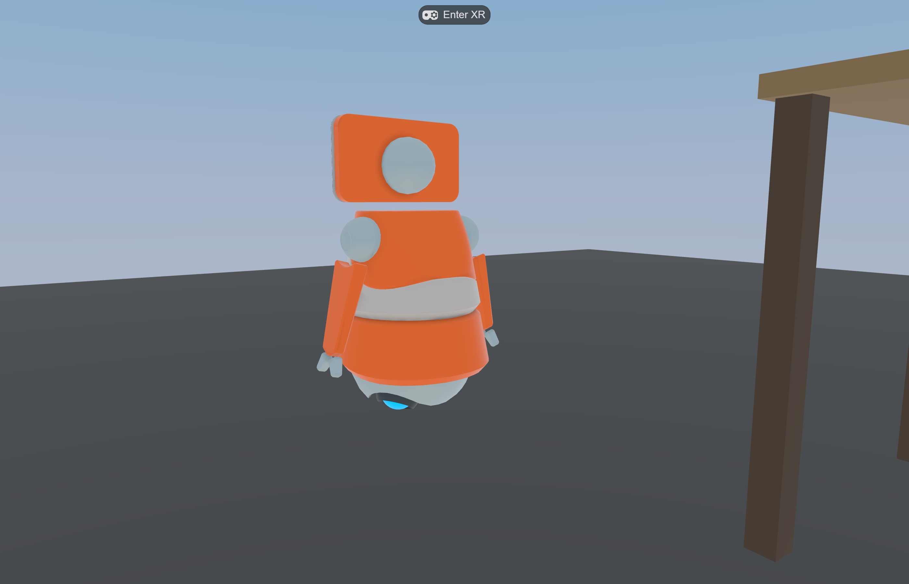<br/><sub>Idle robot character walks a slow circle next to the workspace (procedural — body bobs, looks at direction of motion).</sub></td>
</tr>
</table>

### Interactions
- **`DistanceGrabbable`** — point with controller ray + trigger to grab from anywhere at the table
- **Magnetic snap** — release a part within 27 mm of two valid sockets and it auto-aligns
- **Hover preview** — green socket markers appear at the would-snap position while a part is held
- **Auto tray return** — release in empty space and the part flies back to its tray slot
- **Live circuit evaluation** — union-find over electrical nets; LED `emissiveIntensity` jumps to 1.8 the moment a closed loop forms across battery terminals

### Researcher tools
- **Step HUD** — head-locked instruction panel via `Follower`, peripheral lower-front position, auto-detects current step from snap state
- **Placement guides** — transparent ghost meshes show the target circuit on the breadboard. Toggle with `G` key
- **Telemetry log** — IndexedDB ring buffer, NDJSON export. Open browser console:
  ```js
  await window.telemetry.download();   // saves telemetry-{sessionId}.ndjson
  await window.telemetry.export();     // returns event array
  await window.telemetry.clear();      // resets the DB
  ```

### Telemetry events captured
| Event | Payload |
|---|---|
| `session_start` | `{ iwsdk_version, user_agent }` |
| `session_end` | `{ reason }` (fired on `beforeunload`) |
| `grab_start` | `{ entity_id }` |
| `grab_end` | `{ entity_id, held_duration_ms, snapped }` |
| `socket_connect` | `{ entity_id, socket_a, socket_b }` |
| `socket_disconnect` | `{ entity_id, socket_a, socket_b }` |
| `led_state_change` | `{ entity_id, lit }` |
| `step_advance` | `{ step, total, completed }` |
| `ui_interaction` | `{ element_id, action }` |

Each event includes envelope fields: `event_id` (UUID), `session_id`, `timestamp_ms`, `frame_time_ms`.

---

## Quick start

```bash
npm install
npm run dev
```

Open `https://localhost:8081/` in a desktop browser to preview the scene (no XR controllers, just camera view).

### On a Meta Quest

1. Quest and dev PC on the **same Wi-Fi**
2. Open Meta Quest Browser on the headset
3. Navigate to `https://<your-pc-lan-ip>:8081/` (the "Network" URL printed by Vite at startup)
4. Accept the self-signed certificate warning
5. Tap **Enter VR**

If LAN access is blocked (corporate Wi-Fi, client isolation), use Chrome DevTools port-forwarding via `chrome://inspect/#devices` over USB. Full guide: [iwsdk.dev — Testing Experience](https://iwsdk.dev/guides/02-testing-experience.html).

---

## Architecture

ECS via [`elics`](https://github.com/pmndrs/elics), reactive signals via [`@preact/signals-core`](https://github.com/preactjs/signals), Three.js rendering via IWSDK's `super-three` fork.

### Components

```
src/components/
├── socket-grid.ts       # breadboard layout (cols, pitch, channel gap)
├── snap.ts              # Snappable (lead offsets, current sockets), SnapTarget
├── circuit.ts           # CircuitNode, WireEnds, LedState, PowerSource
└── idle-character.ts    # circular walk parameters
```

### Systems

```
src/systems/
├── snap-system.ts            # pointerup → magnetic snap; emits grab/snap telemetry
├── snap-helpers.ts           # findBestSnap() — shared by SnapSystem + HoverPreview
├── hover-preview-system.ts   # green socket markers while a part is held
├── circuit-eval-system.ts    # union-find net connectivity → LED emissiveIntensity
├── hud-system.ts             # step instructions auto-tracked from snap state
└── idle-character-system.ts  # procedural walk loop with lookAt facing direction
```

### Data flow

```
controller pointerdown  ─────┐
                              ├─→ SnapSystem clears sockets, emits grab_start
                              │
controller pointerup    ─────┤
                              ├─→ SnapSystem.tryToSnap()
                              │     ├─→ findBestSnap → snap transform
                              │     │     └─→ emits socket_connect
                              │     └─→ no snap → return to spawnPos
                              ↓
                       CircuitEvalSystem (every frame)
                              ├─→ build union-find on wires + resistors
                              ├─→ for each LED: check leads vs battery terminals
                              └─→ if topology change: led_state_change + visual update
                              ↓
                       HudSystem (every frame)
                              ├─→ first unsatisfied step = current step
                              └─→ on change: setProperties on UIKit text + step_advance
```

---

## Tech stack

| Layer | Library |
|---|---|
| Framework | [`@iwsdk/core`](https://www.npmjs.com/package/@iwsdk/core) 0.3.1 |
| ECS | [`elics`](https://github.com/pmndrs/elics) (via IWSDK) |
| 3D | [`super-three`](https://www.npmjs.com/package/super-three) 0.181 |
| Spatial UI | [`@pmndrs/uikit`](https://github.com/pmndrs/uikit) |
| Manipulation | [`@pmndrs/handle`](https://github.com/pmndrs/handle) + [`@pmndrs/pointer-events`](https://github.com/pmndrs/pointer-events) |
| Reactivity | [`@preact/signals-core`](https://github.com/preactjs/signals) |
| Build | Vite 7 + [`@iwsdk/vite-plugin-dev`](https://www.npmjs.com/package/@iwsdk/vite-plugin-dev) (IWER emulator + MCP) |
| Telemetry | IndexedDB + NDJSON export |
| Screenshots | Playwright (see `scripts/screenshot.mjs`) |

---

## Status

**Phase 1 (MVP) — implemented**
- Solo breadboard scene, snap interactions, circuit evaluation, telemetry, step HUD, placement guides

**Phase 2 — planned**
- 2-3 person collaborative mode (Colyseus + LiveKit voice)
- Avatar presence (head + 2 hands), object ownership transfer
- Researcher spectator URL (`/spectate?session=...`)
- Shared partner-gaze as the headline experimental manipulation

**Phase 3 — backlog**
- Affective / LLM-driven tutoring agent (in-scene 3D embodiment, telemetry → LLM context)
- Additional maker tasks (modular synth as the strongest 2nd-task candidate — same socket+wire ECS abstraction)
- Replayable session viewer with head/hand pose snapshots

See [`docs/mvp-scope.md`](docs/mvp-scope.md) for the detailed roadmap.

---

## Repository layout

```
virtual-makerspace/
├── src/
│   ├── index.ts               # World.create + scene composition
│   ├── breadboard.ts          # createBreadboard() builder + socket position helper
│   ├── spawn-components.ts    # spawnLed, spawnResistor, spawnWire, spawnBattery
│   ├── placement-guides.ts    # transparent target-circuit ghosts on the board
│   ├── telemetry.ts           # IndexedDB-backed event log
│   ├── components/            # ECS component definitions
│   └── systems/               # ECS systems
├── ui/
│   └── hud.uikitml            # step-by-step HUD panel (compiles to public/ui/hud.json)
├── public/
│   └── gltf/robot/            # idle character mesh
├── docs/
│   ├── mvp-scope.md           # Phase 1/2 scope + telemetry schema
│   └── images/                # README screenshots
├── scripts/
│   └── screenshot.mjs         # Playwright capture script for README hero shots
└── CLAUDE.md                  # IWSDK best practices for Claude Code
```

---

## License

Internal research prototype — not licensed for redistribution at this time.
