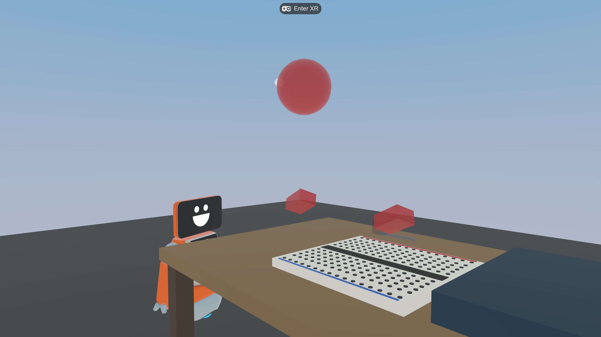
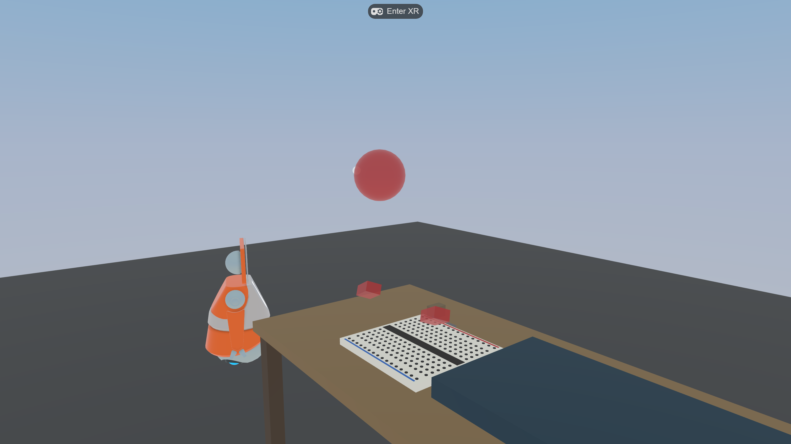

# Virtual Makerspace 사용 튜토리얼

VR 브레드보드 메이커스페이스에서 **LED 회로를 직접 조립**하는 방법을 안내합니다. 혼자 하는 솔로 모드와 둘이 함께 하는 협업(CPS) 모드를 모두 다룹니다. 별도 앱 설치 없이 **헤드셋 브라우저에서 바로** 실행됩니다.

> 대상 기기: Meta Quest 2 / 3 / Pro (브라우저 WebXR). 데스크톱 브라우저에서도 3인칭 미리보기로 열립니다.

---

## 0. 무엇을 만드나요

배터리에서 나온 전류가 LED를 거쳐 다시 배터리로 돌아오는 **닫힌 회로**를 브레드보드 위에 만들고, LED에 불이 들어오게 하는 것이 목표입니다.


*헤드셋을 쓰면 보이는 첫 화면. 가운데 작업대 위에 브레드보드, 오른쪽에 부품 트레이가 있습니다.*

---

## 1. 시작하기 전에

1. Meta Quest 헤드셋을 켜고 **Meta Quest Browser**를 엽니다.
2. 주소창에 배포 URL을 입력합니다: `https://virtual-makerspace.pages.dev`
   - 솔로 연습: `…/?mode=solo`
   - 연구용 식별자 포함: `…/?mode=solo&pid=<참가자ID>&cond=<조건>`
3. 페이지가 뜨면 화면 상단의 **`Enter XR`** 버튼을 응시하거나 컨트롤러로 클릭합니다.


*`Enter XR`를 누르면 몰입형 VR 세션이 시작됩니다. 양손 컨트롤러(또는 맨손 추적)가 작업대 앞에 나타납니다.*

> 권한 요청이 뜨면 허용해 주세요. 협업/음성 모드에서는 마이크 권한도 묻습니다(음성 미설정 시 자동으로 건너뜁니다).

---

## 2. 작업 공간 둘러보기

### 브레드보드


*구멍(소켓)이 격자로 뚫린 흰 판이 브레드보드입니다. 부품의 다리(리드)를 이 구멍에 꽂아 연결합니다. 위·아래 가장자리의 빨간/파란 줄은 전원 레일입니다.*

### 부품 트레이


*오른쪽 파란 트레이에 부품이 놓여 있습니다: 9V 배터리, LED, 저항, 그리고 여러 색·길이의 점퍼선. 필요한 부품을 집어서 브레드보드로 가져옵니다.*

작업대 주변을 천천히 둘러보면 안내용 **로봇 캐릭터**가 돌아다닙니다. 이 로봇은 분위기용이며 상호작용 대상은 아닙니다.

---

## 3. 회로 조립하기 (솔로)

### 3-1. 부품 집기

- **컨트롤러**: 부품을 향해 포인터를 겨눈 뒤 **트리거**를 당겨 잡습니다(원거리에서도 집을 수 있습니다).
- **맨손 추적**: 부품 가까이 손을 가져가 **집는 동작**을 합니다.

### 3-2. 소켓에 맞추기

부품을 브레드보드 구멍 가까이 가져가면, 꽂힐 위치에 **초록색 마커**가 미리 표시됩니다.


*부품을 들고 구멍 근처로 가져가면 "여기에 꽂힙니다"를 알려주는 초록 마커가 나타납니다. 트리거(또는 손)를 놓으면 가장 가까운 유효 위치에 **자석처럼 딱 붙습니다**. 빈 공간에서 놓으면 트레이로 되돌아갑니다.*

### 3-3. 순서대로 연결

1. **배터리**를 보드에 꽂습니다.
2. **점퍼선**으로 배터리 +극에서 LED 쪽으로 연결합니다.
3. **LED**를 꽂습니다(극성에 유의).
4. **나머지 선**으로 LED에서 배터리 -극으로 돌아오게 연결해 고리를 닫습니다.


*절반쯤 조립된 모습. 머리 앞 상단의 **단계 안내(HUD)** 패널이 현재 어떤 부품을 꽂아야 하는지 자동으로 알려줍니다. 안내를 켜고 끄려면 (데스크톱에서) `G` 키를 누릅니다.*

### 3-4. 완성: LED 점등

회로가 올바르게 닫히는 순간 **LED에 불이 들어옵니다**.


*배터리 → 파란선 → LED → 빨간선 → 배터리로 이어진 닫힌 회로. LED가 빨갛게 빛나면 성공입니다. (회로 판정은 실제 전기 시뮬레이션이 아니라 연결 관계로 계산합니다.)*

> 잘 안 되면: 부품을 다시 집어 올리면 연결이 해제되고, 다른 위치에 다시 꽂아볼 수 있습니다. 실패하고 다시 시도하는 과정 자체가 학습 설계의 일부입니다.

---

## 4. 컨트롤 요약

| 동작 | 컨트롤러 | 맨손 추적 |
|---|---|---|
| 부품 집기 | 포인터로 겨냥 + **트리거** 당김 | 부품에 손을 대고 **집기** |
| 놓기 / 꽂기 | 트리거 놓기 | 손 펴기 |
| 이동(텔레포트) | 썸스틱 | (해당 없음) |
| 안내 토글(데스크톱) | `G` 키 | `G` 키 |

---

## 5. 협업 모드 (둘이 함께)

협업 모드는 **두 사람이 한 작업대에서 하나의 회로를 함께** 만드는 모드입니다. 부품이 둘로 나뉘어 있어 **혼자서는 회로를 완성할 수 없고**, 서로 협력해야 합니다.

- **역할 A (전원 담당)**: 배터리 + 파란 점퍼선
- **역할 B (부하 담당)**: LED + 빨간 점퍼선

### 5-1. 같은 방에 들어가기

두 사람이 **같은 room 코드**, 서로 다른 역할로 접속합니다:

```
역할 A:  https://virtual-makerspace.pages.dev/?mode=collab&role=A&room=demo1&pid=alice&nick=Alice
역할 B:  https://virtual-makerspace.pages.dev/?mode=collab&role=B&room=demo1&pid=bob&nick=Bob
```

`room` 값만 같으면 됩니다(`demo1` 자리에 원하는 코드 사용). `pid`는 참가자 식별자, `nick`은 표시 이름입니다.

### 5-2. 파트너 보기

상대가 들어오면, 작업대 너머에 **상대의 머리와 양손**이 나타납니다.


*반투명한 색 구체가 파트너의 머리, 두 개의 색 박스가 양손입니다. 역할 A는 파란색, 역할 B는 빨간색으로 표시됩니다(위 그림은 빨간색 = 역할 B 파트너). 왼쪽의 웃는 얼굴 캐릭터는 상호작용 대상이 아닌 안내 로봇입니다.*


*파트너가 자기 부품을 들고 공유 브레드보드로 손을 뻗고 있습니다. 한 부품은 한 번에 한 사람만 잡을 수 있고, 놓으면 상대가 이어받을 수 있습니다.*

### 5-3. 함께 만들기

1. 서로 무엇을 가지고 있는지 말로 확인합니다(음성 활성화 시).
2. 역할 A가 배터리·파란선을, 역할 B가 LED·빨간선을 보드에 꽂습니다.
3. 두 사람의 부품이 모두 올바르게 연결되면 LED가 켜집니다. **완성은 공동의 성과입니다.**

> 음성: 협업 모드에서 마이크가 자동 연결됩니다(서버에 음성 자격증명이 설정된 경우). 미설정 시에는 음성 없이 나머지 기능이 정상 동작합니다.

---

## 6. 연구자용 메모

- **세션 모드/조건**: URL 파라미터로 제어합니다. `mode=solo|collab`, `role=A|B`, `room=<코드>`, `pid=<참가자ID>`, `nick=<표시명>`, `cond=<실험조건>`.
- **텔레메트리**: 잡기/꽂기/회로 변화는 물론, 협업 모드에서는 **공동 응시(joint gaze), 상대 지향(partner orient), 부품 인계(handoff), 발화 순서교대(turn-take)** 같은 CPS 신호가 PISA 2015 12셀 틀에 맞춰 기록됩니다. 모든 이벤트는 브라우저 IndexedDB에 쌓이고 세션 종료 시 NDJSON으로 내보낼 수 있습니다.
- **데이터 분석**: `scripts/analyze_session.py <export.ndjson>` 로 검증 + 세션 요약 + CPS 타임라인 + PISA 12셀 집계를 출력합니다.
- 자세한 아키텍처와 배포·음성 설정은 [`docs/phase2-cps.md`](phase2-cps.md)를 참고하세요.

---

## 7. 문제 해결

| 증상 | 해결 |
|---|---|
| `Enter XR` 버튼이 없음 | HTTPS 주소인지, Quest Browser인지 확인. 페이지 새로고침. |
| 부품이 안 잡힘 | 포인터를 부품에 정확히 겨냥했는지 확인. 너무 멀면 가까이 이동(텔레포트). |
| 꽂아도 LED가 안 켜짐 | 네 부품이 모두 연결돼 고리가 닫혔는지 확인. 부품을 다시 집어 위치를 조정. |
| 협업에서 파트너가 안 보임 | 두 사람의 `room` 코드가 동일한지, 서로 다른 `role`인지 확인. |
| 화면이 무거움/느림 | 다른 브라우저 탭·앱을 닫고 새로고침. (물리 엔진은 비활성화돼 있어 메모리 부담이 낮습니다.) |

---

문의나 개선 요청은 저장소 이슈로 남겨 주세요: [Educatian/virtual-makerspace](https://github.com/Educatian/virtual-makerspace)
